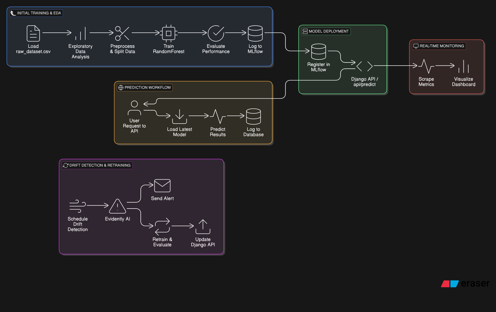

# 🚀 MLOps Pipeline: Automated Model Retraining, Deployment, and Monitoring

## 📌 Project Overview
This **MLOps pipeline** automates the entire lifecycle of a machine learning model, including:

✅ **Initial Model Training & Evaluation** using `MLflow`
✅ **Data Drift Detection** using `Evidently AI`
✅ **Model Retraining & Deployment** with `Airflow` and `Django API`
✅ **Real-Time Monitoring** using `Prometheus & Grafana`
✅ **Email Alerts** when data drift is detected

---

## 🔧 Technologies Used
- **Machine Learning**: `scikit-learn`, `pandas`, `numpy`
- **Model Management**: `MLflow`
- **Drift Detection**: `Evidently AI`
- **Workflow Automation**: `Airflow`
- **Model Deployment**: `Django REST API`
- **Monitoring**: `Prometheus`, `Grafana`
- **CI/CD**:`Jenkins` 

---

## 🔹 Project Workflow




---

## 🚀 Features
### 🔹 **Initial Model Training & Evaluation**
- Load dataset from `data/raw_dataset.csv`
- Perform **Exploratory Data Analysis (EDA)**
- Train a **RandomForest model** (`train_model.py`)
- Evaluate the model and **log metrics to MLflow**

### 🔹 **Model Deployment**
- Deploy the **best-performing model** to **Django API** (`/api/predict`)
- Serve predictions via **REST API**

### 🔹 **Drift Detection & Retraining Pipeline**
- **Airflow DAG** runs `drift_detection.py` daily
- If **drift is detected**, it:
  - **Sends an email alert** 📧
  - **Triggers model retraining** (`model_retraining_evaluating.py`)
  - **Updates MLflow registry & deploys the new model**

### 🔹 **Monitoring & Alerts**
- **Prometheus** scrapes metrics from **Django API** (`/metrics`)
- **Grafana Dashboards** track:
  - Total API requests
  - Prediction latency
  - Drift detection alerts
- Email alerts are sent when drift is detected

---

## 📌 Setup Instructions

### 🔹 **1️⃣ Clone Repository**
```bash
git clone https://github.com/your-repo/mlops-pipeline.git
cd mlops-pipeline
```

### 🔹 **2️⃣ Install Dependencies**
```bash
pip install -r requirements.txt
```

### 🔹 **3️⃣ Start MLflow Tracking Server**
```bash
mlflow server --backend-store-uri sqlite:///mlflow.db --host 0.0.0.0 --port 5000
```

### 🔹 **4️⃣ Run Django API**
```bash
python manage.py runserver 8000
```

### 🔹 **5️⃣ Start Airflow Scheduler**
```bash
airflow scheduler &
airflow webserver --port 8080 &
```

### 🔹 **6️⃣ Start Prometheus & Grafana**
```bash
sudo systemctl start prometheus
grafana-server &
```

---

## 📌 API Endpoints
| **Endpoint** | **Method** | **Description** |
|-------------|-----------|----------------|
| `/api/predict/` | `POST` | Predict with the latest model |
| `/api/deploy/` | `POST` | Reload latest model from MLflow |
| `/metrics/` | `GET` | Prometheus metrics for monitoring |

---

## 📌 Next Steps
✅ **Deploy on Kubernetes**
✅ **Integrate Slack Alerts**
✅ **Use AWS S3 for Data Storage**

📌 *If you're building an MLOps pipeline, let's connect!* 🚀🔥

